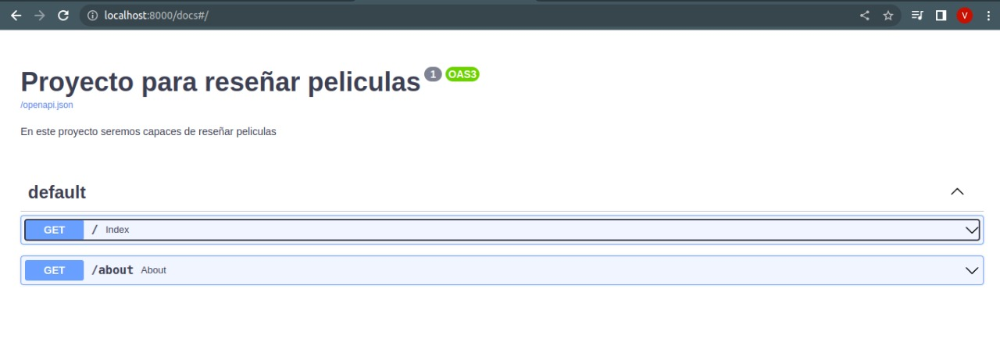
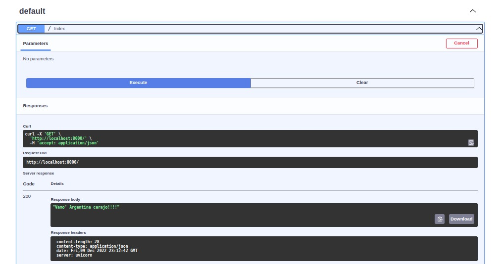
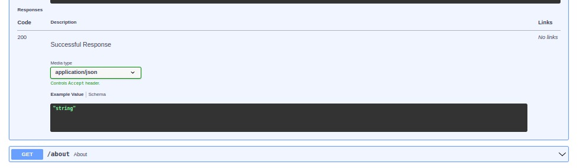

Cuando creamos una app con FastAPI, se crea automaticamente una ruta a la documentación del proyecto. 
Para acceder a la misma, se agrega a la url /docs y se puede visualizar una interfaz, similar a la de Swagger, con la  info que pusimos como parámetros cuando creamos la app, (titulo, descripcion, version, etc)
Tambien podemos  consultar el endpoint con CURL o ejecutandola desde la misma documentacion.

